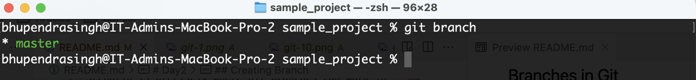
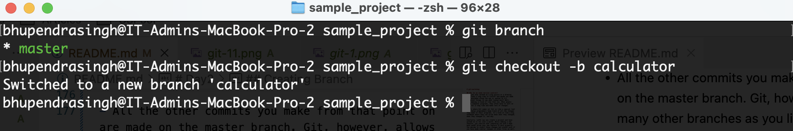
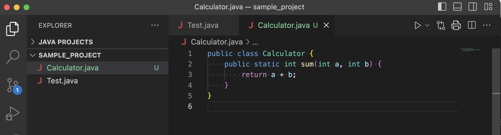
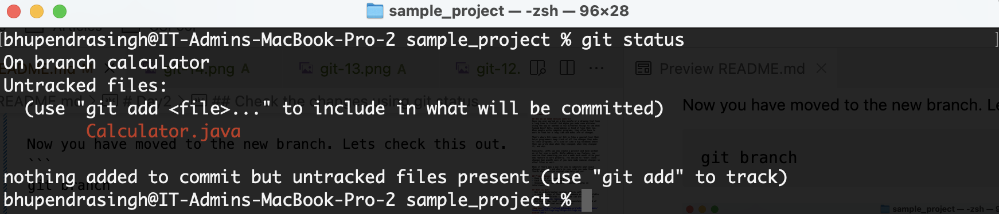
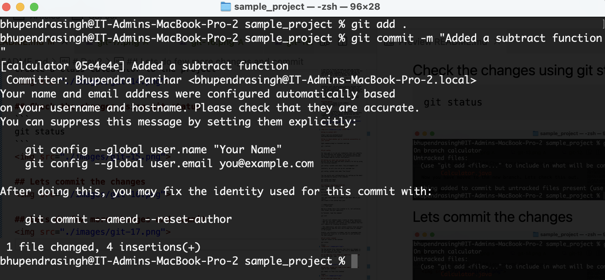
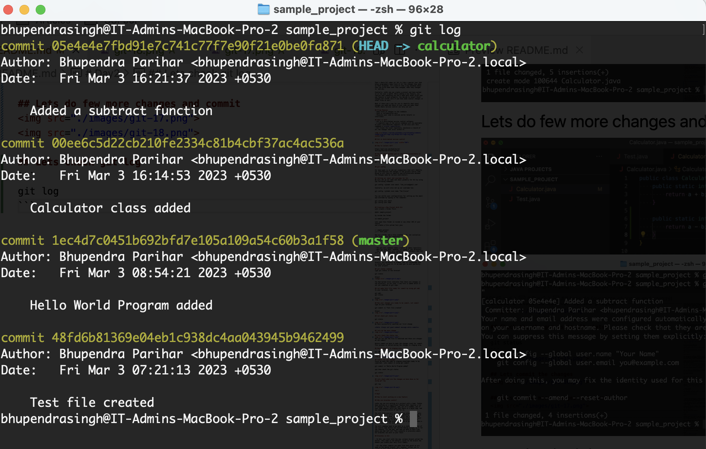
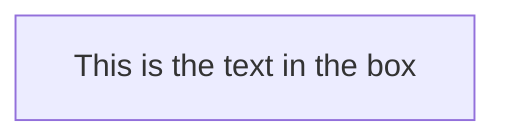

# git-workshop

## Why do we need version control?
Have you ever worked on a big puzzle or a drawing that took a long time to finish? And maybe you made some mistakes along the way or wanted to try different things to see what looked best? Well, programming is kind of like that too. When people write computer programs, they often have to work on them for a long time and make lots of changes.

That's where Git comes in! Git is like a special tool that helps programmers keep track of all the changes they make to their programs. It's kind of like a big notebook where they can write down what they changed, when they changed it, and why.

Similarly, Let’s say you create a project and have worked on it for over a month. While adding a new feature, you realize that something you did a week back won’t allow your new feature to work properly. You decide to revert those changes but aren’t sure if you have made similar changes in other files as well.

What if there was a way for you to identify what exact changes you made and where in your code you made them? That’s where version control can help you out.

## Prime Reasons
- Keep track of changes to the codebase
- Ease in collaborative work
- Showcase your code to outside world( helpful in interviews)

## What is Git?
- Git is a distributed version control software. 
- a complete copy of the entire codebase will be available on every contributor’s computer; we can also call this codebase a **local repository**.
- Git tracks the local repository, maintains a record of all the changes that occur within it.


## Git is distributed version control


## How to install GIT?

https://git-scm.com/book/en/v2/Getting-Started-Installing-Git

## How to check whether git is installed successfully in your system?

Open command prompt or terminal and type
```
git --version
```

## git config

Our main goal is to set our credentials that will identify our contributions and changes in the project source code. Doing so will help us identify and differentiate between the changes made by various contributors.

## Setting our email and username for Git
We will set up our name and email globally for Git by using the following commands:
```
git config --global user.email "tom_curise@gmail.com"
```
Similarly, we will also set up our username too:
```
git config --global user.name "Tom Cruise"
```

You can verify your configurations for setting up the email and username by typing in the commands:
```
git config user.email
git config user.name
```

## Creating a New Project With Git
Lets create a folder first
```
mkdir sample_project
```
Go inside the folder
```
cd sample_project
```
Lets open this folder in vscode or any other IDE of your choice
and create a file called Test.java

```
-- sample_project
|---- Test.java
```
Now we a folder and a file created in it, let initialise this folder into git repository.

In Terminal, type the command
```
git init
```

- The git init command simply creates an empty repository.
- What git init does, however, is create a .git directory. 
- The .git directory will contain all the metadata that Git will require for tracking the project.

- The subdirectory .git will contain several files and more subdirectories that Git will use to keep track of changes in the project.

Usually .git directory is hidden, and its recomended that we should not touch it, if we want git to work perfectly for your project

## git status command
Type git status in the terminal
```
git status
```
Output
<image src="./images/git-2.png">

The Red marked files indicates that there are changes in the directory. In our case, a new file is added which is not yet commited in git repo.

## Let make this file ready for commit by using git add
In your terminal, type
```
git add .
git status
```
Output


## Now your changes are ready to be commit, Let commit
Type on your terminal
```
git commit -m "Test file created"
```
Output


## Let check git status now
```
git status
```

We have successfully comitted our first change

**Note: Always put good comment message while commit**

## Lets do few more change


## Lets check the status now

Now you can see the file is modified and there are changes we can commit.

Before commit we have to make the changes ready for commit. This process is called moving the changes to staging area.

## Moving changes to staging area
```
git add .
git status
```


## Commit the new changes
Since we have the code in staging area(Code ready to be commited). Lets commit it using git commit
```
git commit -m "Hello World Program added"
```
and then check the git status
```
git status
```


## Lets check what are the changes we have done so far using git log
```
git log
```


<br/>

# Day2

## How to start working on a new feature

## Why are branches useful?

Let’s say you are working on a project with a team. You’ve been working on a significant feature that requires a lot of changes to the codebase, and, all of a sudden, one of your team members tells you that there is a major bug, and you need to prioritize it and fix it.

You will find yourself in a confusing situation. Not only will you need to switch context completely by focusing on the new issue at hand, but where will you store all the code you have been working on for the unfinished feature? The bug has nothing to do with the unfinished feature. Fixing the bug along with the feature is going to create a lot of confusion for everyone.

You will somehow need to go back to a state or snapshot of the source code before you started making changes to it for the feature, fix the bug, and then go back to work from where you had left off. This scenario is precisely where Git branches can work in your favor.

## Branches in Git

- In Git, you start with the one, primary branch called the master. This name is the default, given to the branch the moment you create your very first commit.

- All the other commits you make from that point on are made on the master branch. Git, however, allows you to create as many other branches as you like.

- You can create a separate branch that diverts away from the master and continue to do your work from there. The changes you make from that point forward and the commits you create will only be reflected in this branch and will not affect the source code in the master branch.

- When you decide to create a new branch, what Git essentially does is create a new pointer to the current snapshot or commit to your project.

## Creating Branch

So lets say we want to create a feature called "calculator"

Before that let find at what branch you are.

```
git branch
```


Now lets create a branch from master branch

```
git checkout -b calculator
```


Now you have moved to the new branch. Lets check this out.
```
git branch
```


## Lets make some changes to the new branch

Create a class calculator to the project


## Check the changes using git status
```
git status
```


## Lets commit the changes


## Lets do few more changes and commit



## Lets check git log
```
git log
```
Output


you can see, every commit entry has been assigned with a hashcode

